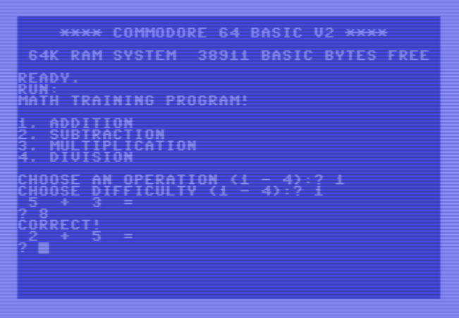

# My first C64 program

In 1985, when I was seven years old, I wrote my first useful computer program in Commodore 64 BASIC.

It was a small math-training program that asked me to choose one of the four basic arithmetic operations and a difficulty level, then presented ten problems and counted the correct answers.

The original program is long gone, so this repository is a reconstruction from memory. I have tried to stay close to how I believe I wrote it at the time, including the limitations and style of C64 BASIC rather than rewriting it using modern programming practices.

The program has been translated from Swedish to English.



## Build and run

The source is plain-text Commodore BASIC V2 and is converted to a C64 PRG using `petcat`, which is included with VICE.

Requirements:

- VICE
- `petcat`
- `make`

Build:

```bash
make
```

Run in VICE:

```bash
make run
```

The generated PRG is written to `build/math.prg`.

## Source

The reconstructed program is in:

`src/math.bas`

## Background

I wrote more about the original program and why I recreated it here:

https://www.bitsbylisa.se/back-to-basic-c64-version/

## License

MIT